# RNN & LSTM for Text Generation

## 📋 Overview

Built and compared Recurrent Neural Networks (RNN) and Long Short-Term Memory (LSTM) networks for character-level text generation, demonstrating the advantages of LSTM in capturing long-term dependencies

## 🎯 Problem Statement

Traditional RNNs struggle with long sequences due to vanishing gradients. This project:
- Implements both RNN and LSTM from scratch in PyTorch
- Compares performance on text generation task
- Demonstrates LSTM's superior handling of long-term dependencies

## 🏗️ Architecture

### Simple RNN 
    
<br>
<br>

### LSTM 


**Key Innovation:** LSTM's cell state provides "memory highway" solving vanishing gradient.

## 📊 Results

| Model | Final Loss | Training Epochs | Text Quality |
|-------|-----------|----------------|--------------|
| **RNN** | 0.84 | 150 | Repetitive patterns |
| **LSTM** | 0.36 | 150 | Coherent longer sequences |

**Improvement:** 50% loss reduction with LSTM

### Training Curves


### Generated Text Samples

**RNN Output:**
The cat sat on the mat the cat sat on the mat the cat


**LSTM Output:**
The cat, which had been sleeping peacefully in the afternoon sun


## 🛠️ Technologies

- **Framework:** 
- **Language:** 
- **Key Concepts:** RNNs, LSTMs, Sequence Modeling, Backpropagation Through Time

## 🚀 How to Run

### Installation
```bash
git clone https://github.com/aatif-pathan001/RNN-LSTM-Learning
cd RNN-LSTM-Learning
pip install -r requirements.txt
```
## 💡 Key Learnings

1. **LSTM solves vanishing gradient** through additive cell state updates
2. **Gates provide selective memory** - forget gate removes irrelevant info
3. **Training stability** - Gradient clipping (5.0) essential for RNN/LSTM
4. **Sequence length matters** - LSTM advantage increases with longer dependencies

## 🔄 Advance Optimization
- **Optimizer:** SGD → Adam → **AdamW** (best: 0.59 loss)
- **Regularization:** Added dropout (0.3), gradient clipping (5.0)
- **LR Scheduling:** ReduceLROnPlateau (adaptive)
- **Early Stopping:** Patience 10 epochs

**Result:** 3.75x faster convergence (40 epochs vs 150)

## 📈 Future Improvements

- [ ] Try GRU (simpler than LSTM, often comparable)
- [ ] Implement attention mechanism
- [ ] Bidirectional LSTM for better context
- [ ] Larger dataset for better text quality

---

## 🤝 Connect

- **GitHub**: [@aatif-pathan001](https://github.com/aatif-pathan001)
- **LinkedIn**: [Aatif Khan Pathan](https://linkedin.com/in/aatif-khan-pathan)
---

**Author**: Aatif Khan Pathan  
**Started**: February 13, 2026   
*Part of 12-week ML intensive learning journey. Week 1: Sequence Modeling.*
